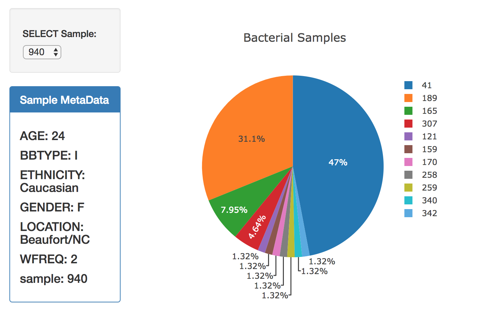
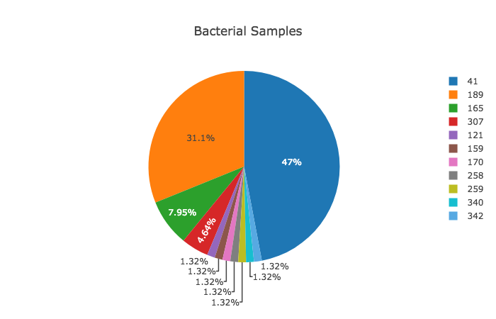
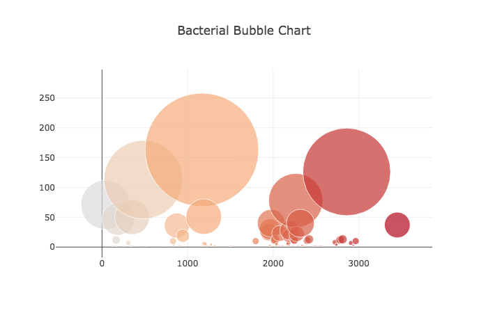

# 15-Interactive-Visualizations-and-Dashboards

## Create an interactive dashboard using python and javascript to show belly button bacterial diversity

### Screenshots of Dashboard:

#### Choose the bacterial cultures:

#### View the pie graph of the samples:

#### A bubble chart of the samples:
